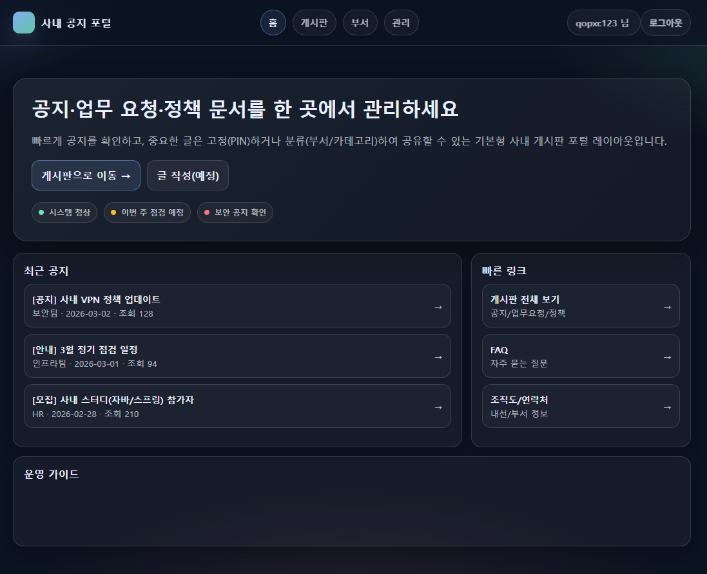
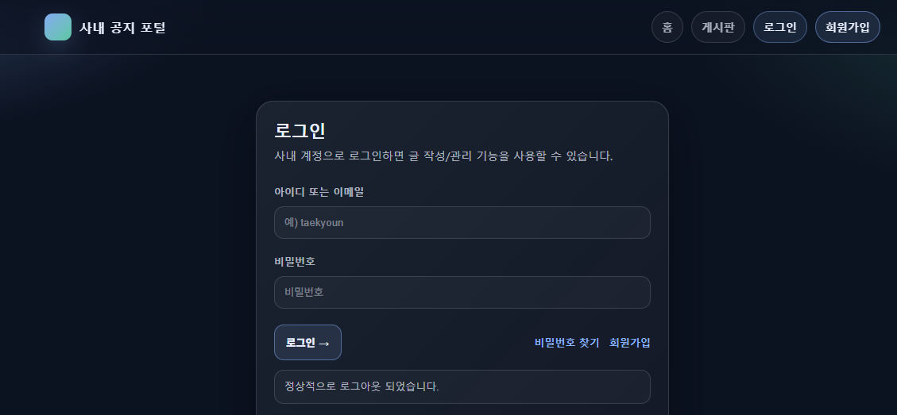
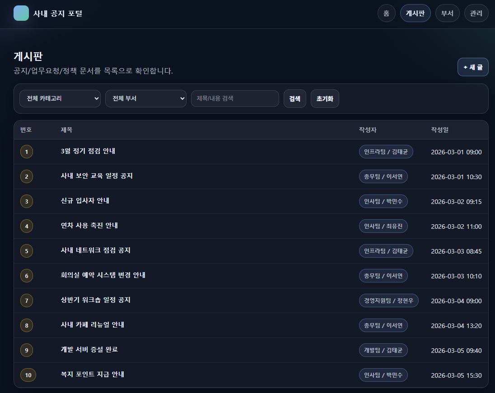

# 사내 공지 게시판

Spring Boot와 Spring Security를 이용해 만든 간단한 사내 공지 게시판입니다.

## 프로젝트 소개

공지사항을 작성하고 조회할 수 있는 게시판이며  
Spring Security 기반 로그인/세션 인증 기능을 포함합니다.

## 기술 스택

- Backend
  - Java 17
  - Spring Boot
  - Spring Security
  - Spring Data JPA

- Frontend
  - Thymeleaf
  - HTML / CSS

- Database
  - PostgreSQL

## 주요 기능

- 회원가입
- 로그인 / 로그아웃
- 게시글 작성
- 게시글 조회
- 게시글 수정 / 삭제

## 인증 방식

Spring Security의 **세션 기반 인증 방식**을 사용했습니다.

## 화면

### 메인 화면

### 로그인

### 게시판

